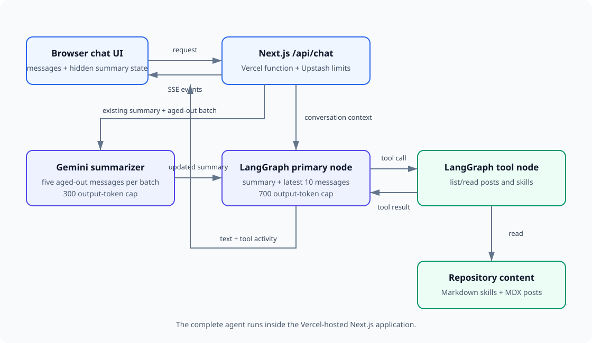

# wongbot

Personal website for Jia Hwee Wong. Wongbot (a pun on "wongbok cabbage 🥬") is the AI chatbot homepage — ask it anything about me.

## Stack

| Layer | Tech |
|---|---|
| Frontend | Next.js 16, Tailwind CSS v4, react-markdown |
| API + agent | Python 3.12, FastAPI, LiteLLM |
| LLM orchestration | Python tool loop with conversation summarization |
| Hosting | Vercel frontend + Python backend |

## Project structure

```
wongbot/
├── frontend/
│   ├── app/
│   │   └── api/chat/     # Thin streaming proxy to the Python backend
│   ├── content/
│   │   ├── posts/        # MDX blog posts (public)
│   │   └── skills/       # Markdown context files for Wongbot (private)
│   └── lib/
│       └── content.ts    # Reads blog posts for frontend pages
├── backend/
│   ├── routers/chat.py   # SSE chat endpoint
│   └── services/
│       ├── agent.py      # Summarization, tool calls, and response streaming
│       ├── content.py    # Blog and skill tools
│       └── prompts.py    # Wongbot prompts
├── docker-compose.yml
└── Makefile
```

## Agent architecture



The browser keeps conversation state for the current page session. The primary
agent receives the latest 10 messages verbatim plus a rolling summary of older
context. Summarization starts once five messages have moved outside that recent
window. Later updates summarize aged-out messages in five-message batches,
avoiding a summarizer request on every turn. Any smaller pending batch remains
in the primary context until it is summarized, so no conversation context is
dropped.

The Python agent exposes four read-only tools:

- `list_blog_posts`
- `read_blog_post`
- `list_skills`
- `read_skill`

Tool calls, tool results, and response text are streamed to the UI as
server-sent events. Summary updates use the same stream but remain hidden from
the visible transcript.

The backend limits each IP to 10 requests per day and the whole process to 100
requests per day by default. Primary responses are capped at 700 completion
tokens, while summary updates are capped at 300. These safeguards are
configurable through environment variables. The counters are in memory, so
deployments with multiple workers or replicas should use a shared persistent
limiter before relying on them as a strict spending boundary.

## Quick start

**First-time setup:**

```bash
cd backend
cp .env.example .env      # fill in your provider API key
uv sync
uv run uvicorn main:app --reload
```

In another terminal:

```bash
cd frontend
cp .env.example .env.local
npm install
npm run dev                # → http://localhost:3000
```

**`backend/.env` — required vars:**

```
LLM_MODEL=gemini/gemini-3-flash-preview
GOOGLE_API_KEY=...
CONTENT_DIR=../frontend/content
RATE_LIMIT_PER_DAY=10
GLOBAL_RATE_LIMIT_PER_DAY=100
MAX_RESPONSE_TOKENS=700
MAX_SUMMARY_TOKENS=300
```

**`frontend/.env.local`:**

```
NEXT_PUBLIC_API_URL=http://localhost:8000
```

### Docker (full stack with backend)

```bash
make docker   # builds and starts both services via docker compose
```

Requires `backend/.env` to exist with your API key. See `backend/.env.example`.

### Wongbot context

Fill in `frontend/content/skills/about.md`, `projects.md`, and `achievements.md` — this is how Wongbot knows about you. The Python agent can read these skill files and public blog posts through tools during a conversation.

## Makefile

```bash
make docker   # docker compose up --build
make lint     # ruff check (backend)
make fix      # ruff check --fix (backend)
make format   # ruff format (backend)
make check    # lint + format dry-run
```

## Deployment

Deploy the frontend to Vercel with:

- **Root Directory**: `frontend`
- **Framework Preset**: `Next.js`
- **Env var**: `NEXT_PUBLIC_API_URL=https://your-python-backend.example.com`

Deploy `backend/` to a Python host with the variables from `backend/.env.example`.
